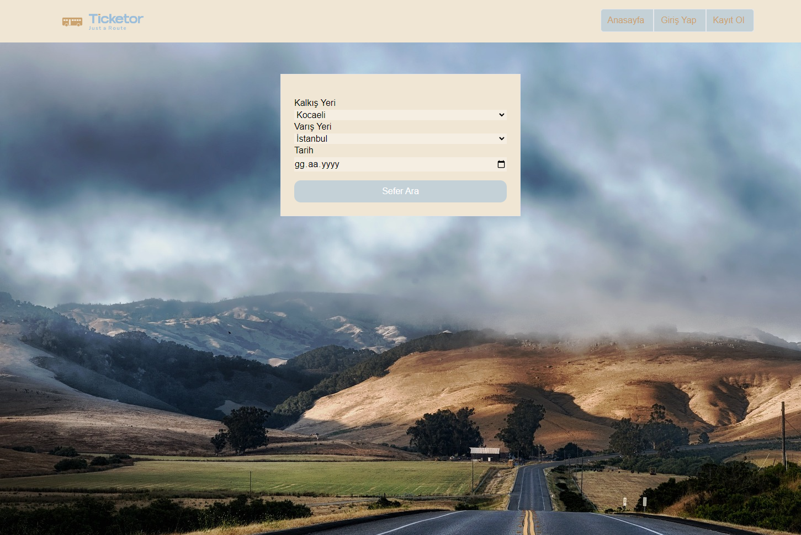

# Çalıştırma Aşamaları

-1.npm install

-2.npm run dev

-3.sefer aramasında 18.10.2023 tarihini seçiniz (sefer dataları o tarihe giriş yapıldı)

# Deploy Hali
[Bağlantı](https://ticketor-tawny.vercel.app/)
# Kullanılan Teknolojiler
-nextJs (13.5.4) ==> Projeyi çalıştıran React FrameWork'ü.

-Tailwindcss ==> Elementlere style vermek için kullanıldı.

-Context ==> State erişimi sağlamak için kullanıldı.

-LocalStorage ==> Login ve Register için bir API'dan faydalanılmadığı için kullanıcı verileri localStorage da depolandı oradan yönetildi.

-uuid(9.0.1) ==> rasgele id üretmek için kullanıldı.

-TypeScript ==> Js e type hassiyeti kazandırmak için jsx uzantısı yerine tsx uzantısı kullanıldı. 

### Kullanılan tekonolojilerin detayı için package.json dosyasını inceleyebilirsiniz

